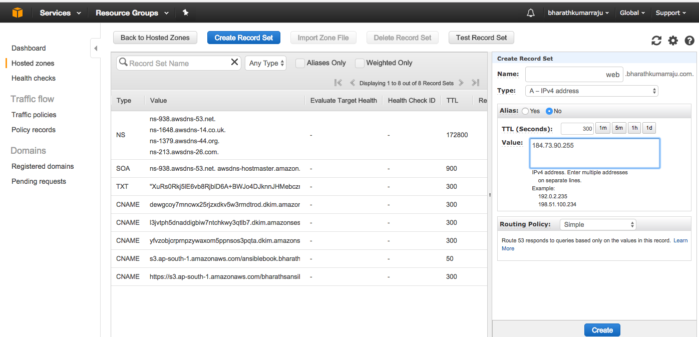

# nginx

## Install Nginx  :beginner:
 TODO: Before installing Nginx in your Linux You have to stop `iptables` and the `selinux`
  ```
   service iptables stop ; systemctl stop iptables
   setenforce 0

  ```
 In order to install nginx add EPEL repo to your /etc/yum.repos.d 

 1. Download using wget and install as below in RHEL7 Machine
 
   ` cd /tmp/; wget "https://dl.fedoraproject.org/pub/epel/epel-release-latest-7.noarch.rpm" ;yum install -y  epel-release-latest-7.noarch.rpm; yum insall -y nginx `

### Verify and start nginx
   
 ` systemctl status nginx ; systemctl start nginx `

  Check the process with `ps -eaf | grep -i nginx`

 If you are familiar with AWS Route53 Add a recordset and test with below...you can also test with IP as well.




#### INTRO ABOUT NGINX 

  So People say it is  HTTPD Webserver some may say it also does proxy and reverse proxy and HTTP Caching someothers also says it beautifully does Loadbalancing and request handling and rolling updates in more efficient way... 
so here i am witnessing all those are absolutely true, and more importantly those are FREE of cost as well.

#### How NGINX more effective than apache

Eventhough the Apache is KING of HELL nginx keep gainig its traction in terms of WEB connectivity but why? Dosen't mater what is the webserver ultimately it should serve the web requests without any errors as far a i know the difference is APACHE and NGINX handling these type of requests very differently.

so as per wiki APACHE generates a thread like java for each request and does all its work in that thread itself so wiki says it occupies memory for each thread separately.....where as NGINX shares the memory across the threads asynchronously how means i don't know :heart_eyes: :heart_eyes: :heart_eyes::heart_eyes: they say like that so we follow :stuck_out_tongue_winking_eye: :stuck_out_tongue_winking_eye:

* so nginx maintains thousands and thousands of connections maintains keep alive of session states in a small memory  units

So the features ranging from  Bandwidth Throttling to URL REdirects/Rewriting to IPV6 Compatible to Geolocation of IP'S


